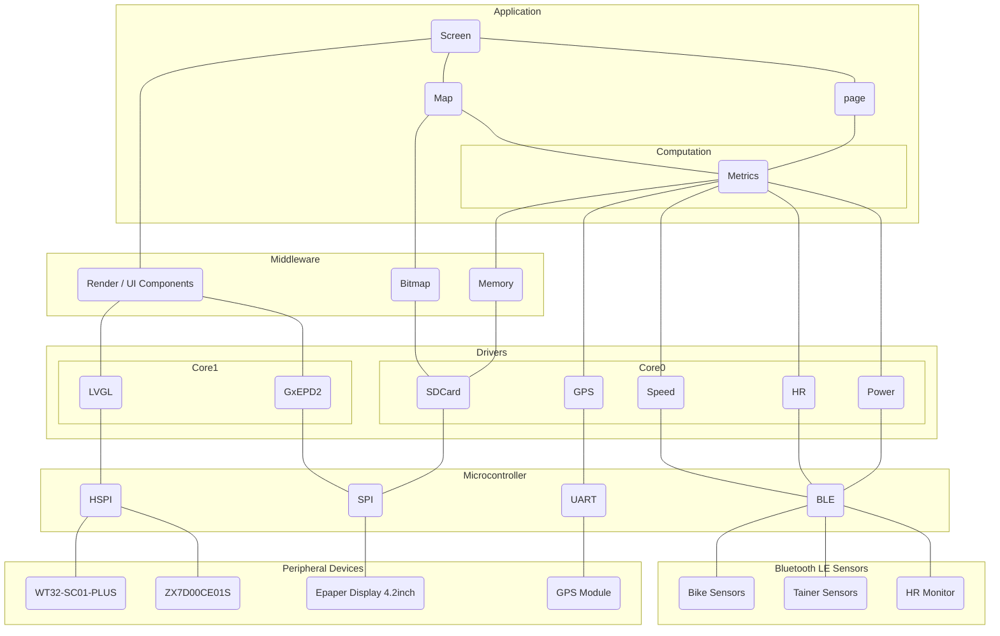
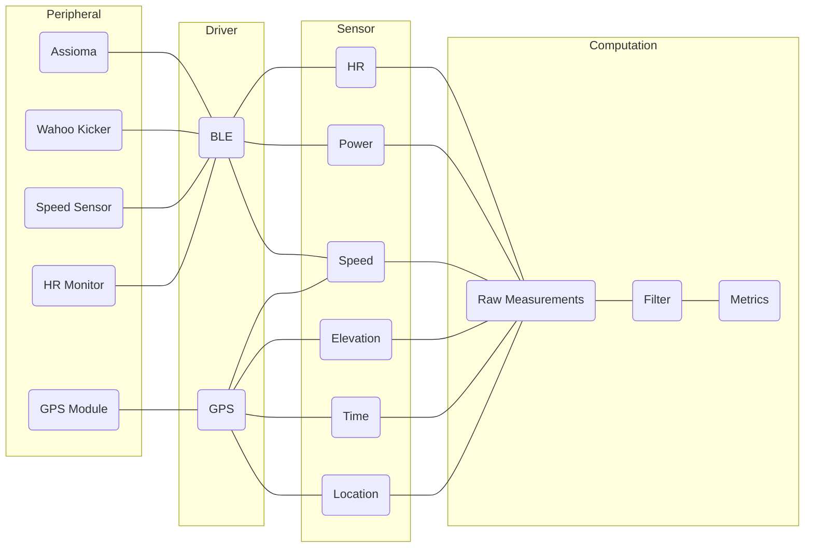

# velometa

Bike computer for training purpose. The goal is build a device that can present the required information during trainng rides outdoors or indoors.

## Core Sensors

Cores sensors are mainly commercial BLE devices, that provide metrics like HR, Watt, Speed, Cadence and so on. Typically these sensor will provide a measurement once every second.

- [x] Watt
- [x] HR
- [x] Speed
- Cadence

### Sensors
  

## Experimental Sensors

- [x] GPS
- [x] Static Pressure/Altitude
- [x] Differential Pressure/Pitot tube
- [x] Humidity
- [x] Temperature
- Slope
- Road Vibration
- [x] Airspeed
- [x] Wind Speed
- [x] Position
  - [x] Simple distance tracking (VL53L0X)
  - Advanced multi area distance tracking (VL53L7CX ultrawide FoV)
- Wind Angle
- Tire Pressure
- O2
- CO2

### Sensors 

#### BME280
#### BME581
#### XGZP6897D
#### MPU9250
#### MPU6050
#### BMI160
#### BMI270
#### BMI088
#### ADXL345
#### ADXL355
#### VL53L0X

## Calculated Metric

- [x] Zones
  - [x] HR
  - [x] Power
- ride ftp
- Avg Weighted Power
- Training Load
- W'
- W'bal
- Work above threshold
- HR drift (decoupling)
- CdA

## Sensor connectivity / integration

- BLE for the commercial sensors.

## Data Storage

- Store Timeseries of all connected sensors at all times when device is turned on.
- Activity start/end/pause are stored as markers, so no data is lossed if forgot to start.

## Random Ideas

- Support multi-sensor for 1 metric (2 power meters)
- Control the training bike (adjust resistance ERG)

## Architecture

## Sensor Data Collection

