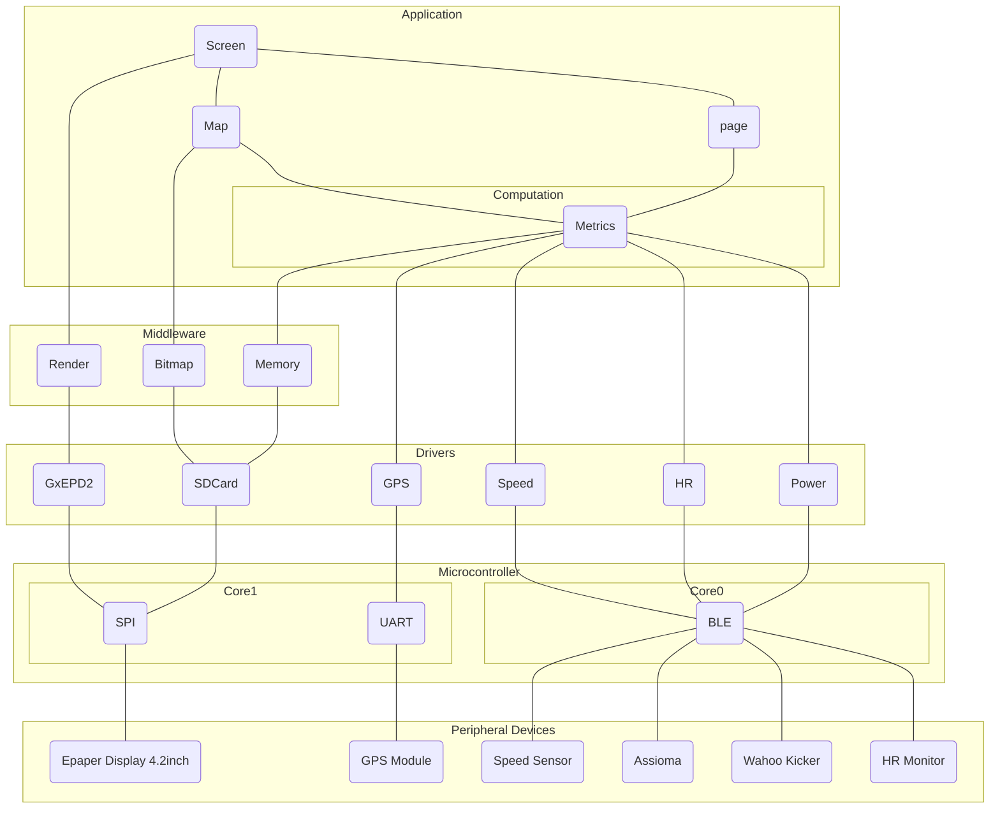

# VeloHUB

Bike computer for training purpose. The goal is build a device that can present the required information during trainng rides outdoors or indoors.

## Sensor reading

- Watt
- HR
- Speed
- Cadance
- GPS

## Experimental

- Static Pressure/Altitude
- Differential Pressure/Pitot tube
- Humidity
- Temperature
- Slope
- Road Vibration
- Airspeed
- Wind Speed
- Wind Angle
- Tire Pressure

## Calculated Metric

- normalized Power
- training stress value
- W'
- Work above threshold
- HR drift (decoupling)
- CdA
- Zones
  - HR
  - Power
- ride ftp

## Sensor connectivity(integration

- BLE for the commercial sensors.

## Data Storage

- Store Timeseries of all connected sensors at all times when device is turned on.
- Activity start/end/pause are stored as markers, so no data is lossed if forgot to start.

## Random Ideas

- Support multi-sensor for 1 metric (2 power meters)
- Control the training bike (adjust resistance)

## Architecture

